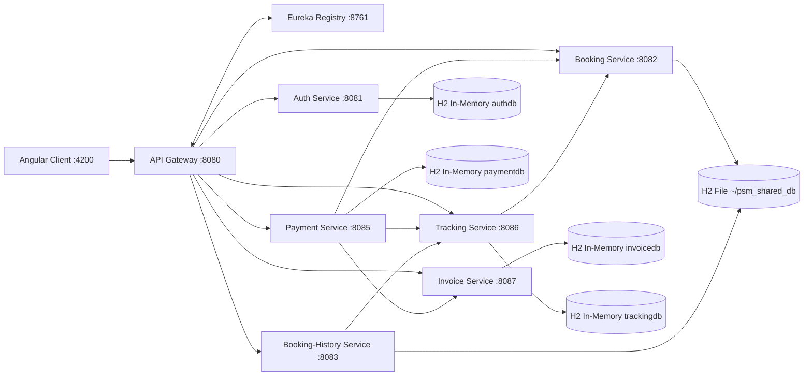
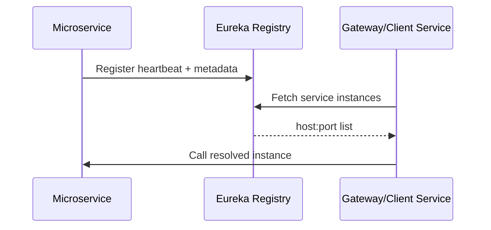
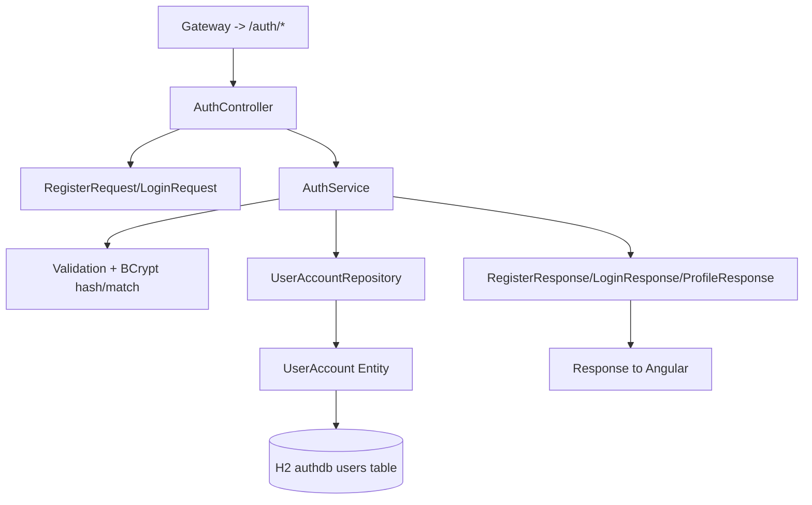
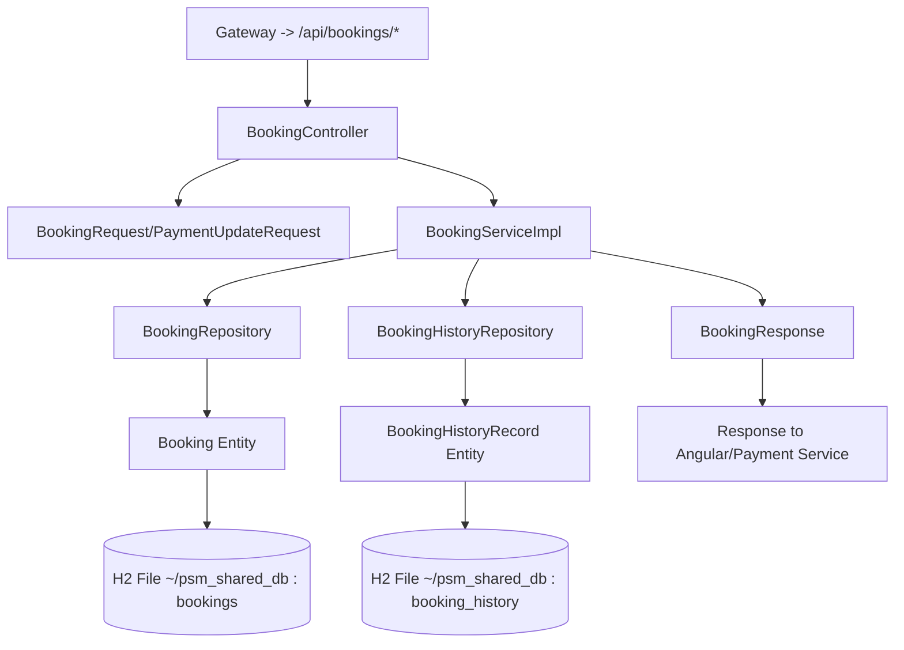
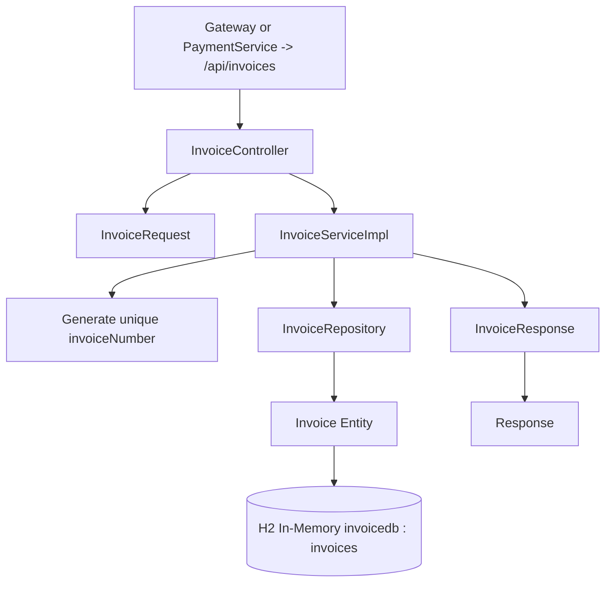
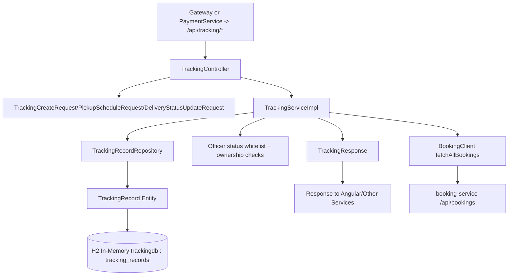
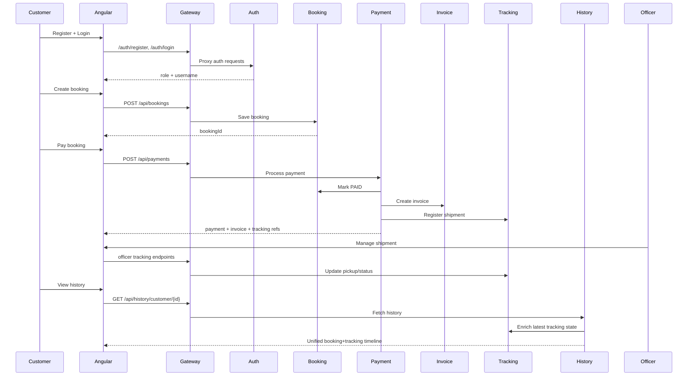

# PMS Microservices Detailed Flow

## 1) End-to-End Topology



## 2) API Gateway

### Responsibilities
- Single ingress for frontend requests.
- CORS for Angular localhost:4200.
- Path-based routing to lb://service-name targets via Eureka.

### Diagram
```mermaid
flowchart TB
    C[Client Request] --> GW[Gateway Route Predicate]
    GW --> R1[/auth/** -> lb://auth-service]
    GW --> R2[/api/bookings/** -> lb://booking-service]
    GW --> R3[/api/history/** -> lb://booking-history-service]
    GW --> R4[/api/payments/** -> lb://payment-service]
    GW --> R5[/api/invoices/** -> lb://invoice-service]
    GW --> R6[/api/tracking/** -> lb://tracking-service]
    GW --> RH2[h2/* rewrite routes]
```

### Internal stack mapping
- Controller: Not applicable (configuration-driven gateway).
- DTO: Not applicable.
- Service: Not applicable.
- Repository: Not applicable.
- DB: Not applicable.

## 3) Service Registry (Eureka)

### Responsibilities
- Registers service instances.
- Provides discovery catalog for gateway and load-balanced RestTemplate clients.

### Diagram


### Internal stack mapping
- Controller/DTO/Service/Repository/DB: Not used for business data.

## 4) Auth Service

### Main client interactions
- POST /auth/register
- POST /auth/login
- GET /auth/profile/{customerUsername}

### Internal flow


### Notes
- Officer login is hardcoded in service logic (officer01).
- Customer path uses repository-backed lookup and bcrypt password verification.

## 5) Booking Service

### Main client interactions
- POST /api/bookings
- GET /api/bookings/{id}
- GET /api/bookings/unpaid?customerId=...
- PUT /api/bookings/{id}/payment
- GET /api/bookings

### Internal flow


### Data behavior
- New bookings are persisted in bookings table.
- When payment status is updated to PAID, service writes booking_history row if missing.

## 6) Booking-History Service

### Main client interactions
- GET /api/history/customer/{customerId}
- GET /api/history/officer?customerId=&startDate=&endDate=

### Internal flow
```mermaid
flowchart TB
    Req[Gateway -> /api/history/*] --> C[BookingHistoryController]
    C --> S1[JPA Query via BookingHistoryRepository]
    S1 --> E1[BookingHistory Entity]
    E1 --> DB[(H2 File ~/psm_shared_db : booking_history)]

    C --> Fallback[JdbcTemplate fallback on bookings]
    Fallback --> DB2[(H2 File ~/psm_shared_db : bookings)]

    C --> X[TrackingLookupClient]
    X --> T[tracking-service /api/tracking/officer/booking/{id}]

    C --> DTO[BookingHistoryDto/PageResponse]
    DTO --> Resp[Response to Angular]
```

### Data behavior
- Primary source is booking_history table.
- If empty, service pulls paid bookings from bookings table.
- Enriches status using tracking-service officer lookup API.

## 7) Invoice Service

### Main client interactions
- POST /api/invoices (normally called by payment-service)
- GET /api/invoices/{id}
- GET /api/invoices?customerId=

### Internal flow


### Data behavior
- Persists full billing and parcel metadata per payment transaction.

## 8) Payment Service

### Main client interactions
- GET /api/payments/bill/{bookingId}
- POST /api/payments

### Internal flow
```mermaid
flowchart TB
    Req[Gateway -> /api/payments/*] --> C[PaymentController]
    C --> D1[PaymentRequest]
    C --> S[PaymentProcessor]

    S --> BC[BookingClient]
    BC --> B[booking-service /api/bookings/{id}]

    S --> Validate[Amount/status/card expiry checks]
    Validate --> R[PaymentRepository]
    R --> E[Payment Entity]
    E --> DB[(H2 In-Memory paymentdb : payments)]

    S --> BUPD[BookingClient markPaid]
    BUPD --> B2[booking-service PUT /api/bookings/{id}/payment]

    S --> IC[InvoiceClient]
    IC --> I[invoice-service POST /api/invoices]

    S --> TC[TrackingClient]
    TC --> T[tracking-service POST /api/tracking/internal/register]

    S --> D2[PaymentResponse]
    D2 --> Resp[Response to Angular]
```

### Data behavior
- Payment is an orchestration service:
  - Reads booking bill,
  - Persists payment,
  - Marks booking PAID,
  - Creates invoice,
  - Registers tracking shipment.

## 9) Tracking Service

### Main client interactions
- POST /api/tracking/internal/register (from payment-service)
- GET /api/tracking/officer/shipments
- GET /api/tracking/officer/booking/{bookingId}
- PUT /api/tracking/officer/booking/{bookingId}/pickup
- PUT /api/tracking/officer/booking/{bookingId}/status
- GET /api/tracking/{bookingId}?customerId=

### Internal flow


### Data behavior
- On startup, backfills paid bookings into tracking records.
- Generates unique 12-digit tracking number.
- Officer updates restricted to allowed statuses.

## 10) Frontend-to-Service Mapping

```mermaid
flowchart LR
    F[Angular services/*ApiService.ts] --> G[Gateway :8080]
    F --> A1[/auth/*]
    F --> B1[/api/bookings/*]
    F --> H1[/api/history/*]
    F --> P1[/api/payments/*]
    F --> I1[/api/invoices/*]
    F --> T1[/api/tracking/*]
```

- AuthApiService -> Auth paths
- BookingApiService -> Booking paths
- BookingHistoryApiService -> History paths
- PaymentApiService -> Payment paths
- InvoiceApiService -> Invoice paths
- TrackingApiService -> Tracking paths

## 11) Complete business journey (customer + officer)



## 12) Source references

- Gateway routes: backend/api-gateway/src/main/resources/application.yml
- Service registry: backend/service-registry/src/main/resources/application.yml
- Auth flow: backend/auth-service/src/main/java/com/example/auth/controller/AuthController.java and backend/auth-service/src/main/java/com/example/auth/service/AuthService.java
- Booking flow: backend/booking-service/src/main/java/com/example/booking/controller/BookingController.java and backend/booking-service/src/main/java/com/example/booking/service/BookingServiceImpl.java
- History flow: backend/booking-history-service/src/main/java/com/example/bookinghistory/controller/BookingHistoryController.java
- Payment orchestration: backend/payment-service/src/main/java/com/example/payment/service/PaymentProcessor.java
- Invoice flow: backend/invoice-service/src/main/java/com/example/invoice/service/InvoiceServiceImpl.java
- Tracking flow: backend/tracking-service/src/main/java/com/example/tracking/service/TrackingServiceImpl.java
- Angular integration: frontend/src/app/services/*.ts
